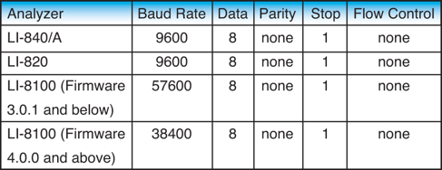

 
 

# FluxPuppy
Android Interface to Licor LI-820 and LI-840 gas analyzers using Bluetooth and USB ports

## Introduction

FluxPuppy is a mobile Android application for use with the LI-840A gas analyzer. 
The application can be used to observe, collect, and organize data streamed from the analyzer into user specified data sets. 
FluxPuppy is designed to replace the data collection system implemented by LI-COR, by providing many features not present in the current system such as advanced organization, live data readout, and included metadata.

## Installation Requirements

In order to successfully use the application, the user will need an Android tablet device running Android 7.0 or higher, as well as an LI-840A gas analyzer and all the cables that come included with it. 

**NOTE:** The software may also work on mobile phone devices running Android 7.0 or higher, but the software was designed for tablet sized screens, and UI elements may appear differently than they do in the manual.

## Quick Start Guide

#### 1. How To Install Flux Puppy
The installation requires downloading the APK file named “FluxPuppy.apk” from the __binary__ directory on the Github repo. The APK can be found [here](https://github.com/bnasr/FluxPuppy/raw/master/binary/FluxPuppy.apk). Open the APK file, it will ask if you would like to Install Flux Puppy, press **Install**. Then press **DONE**. Navigate to **ALL APPS** where Flux Puppy will be found. Open Flux Puppy. You will be prompted to allow for permissions on the Camera, Location, and Storage. The app will not allow you to proceed without these permissions

#### 2. To Begin Making a Measurement:
To begin a measurement press **START NEW DATA SET**. This will take you to the Metadata screen.

#### 3. Entering Metadata:
Using the keypad on the Android device, type in required fields “Operator”, “Site Name”, and “Sample ID”. Optional fields and photo can be added, but are not required. Press **START MEASUREMENT**. This will take you to the Graphing screen.

#### 4. Recording Data:
Flux Puppy will ask how you are connecting to the IRGA, Leashed (with a USB cord) or Unleashed (Bluetooth), select your connection. Data should begin streaming and be visible on the graph. A warning at the top of the screen will remain until the IRGA is sufficiently warmed-up. Press **START LOGGING** to begin recording data. A reminder chime will notify you if you haven’t started logging after 5 minutes. Graph zoom can be enabled by pressing **ENABLE ZOOM** and using pinch zoom gestures. To stop logging, press **STOP LOGGING**. This will take you to the File Directory screen.

#### 5. Post Measurement Viewing and Editing Data:
The new dataset will be listed at the top of the list in the File Directory. Select the file and press **VIEW** to view and manipulate the data. This will take you to the View screen. R-squared and regression slope statistics are automatically calculated from all CO 2 data logged. Data can be trimmed by entering in start and end x-axis values (in seconds) separated by a comma (example: 60,100) and pressing **APPLY SUBGRAPH**. To save newly trimmed dataset, press **SAVE SUBGRAPH** AND EXIT. This will save a new dataset with metadata and trimmed raw data file. Otherwise press **EXIT**. This will not alter the original data set collected. These options will return you to the File Directory screen.

#### 6. Data Management and Transfer:
All datasets are visible in a list in the File Directory screen. The newest datasets are listed on top. Datasets can be filtered by entering text and pressing **APPLY FILTER**. Datasets can be deleted by selecting and pressing **DELETE**. Datasets can be transferred off of the Android device by selecting and pressing **UPLOAD**. This option will bring up email and shared drive applications on the Android device. If you do not have a transfer applications installed, it will prompt you to install one. Select the transfer application of choice. Once transfer is complete, it will return you to the File Directory screen in Flux Puppy.

#### 7. Troubleshooting:
Bluetooth connection not working: it is necessary to configure the communication settings of the Bluetooth adapter with a computer to match those of the IRGA (the RS-232 port is configured as Data Terminal Equipment (DTE) with no hardware handshaking): BaudRate: 9600bps, DataBits: 8, Parity:None, StopBits:1, FlowControl: None; See LI-820/840 manual).

#### 8. Bluetooth Mode and Baud Rate:
When using the Bluetooth adaptor, note that the default baud rate of the adaptor might be different than the baud rate of the LI-COR device. In that case, you need to configure the BT device as described in its manual. You can find more information from [here](http://www.licor.com/env/newsline/2016/02/troubleshooting-rs-232-connectivity-issues-for-li-cor-analyzers/) and the figure below.

